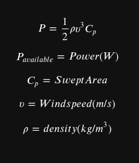
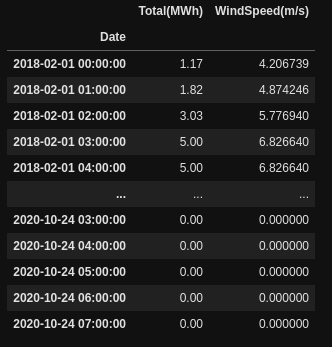

# Wind Speed Predictoin
## We will make use of wind turbine power calculations:

### Determine the velocity given the predicted energy outputs from wind powerplants. Most power plants announce thier expected power outputs 24 hr before realization.

**Number of wind turbines was also taken into account!**
## Sample output:

